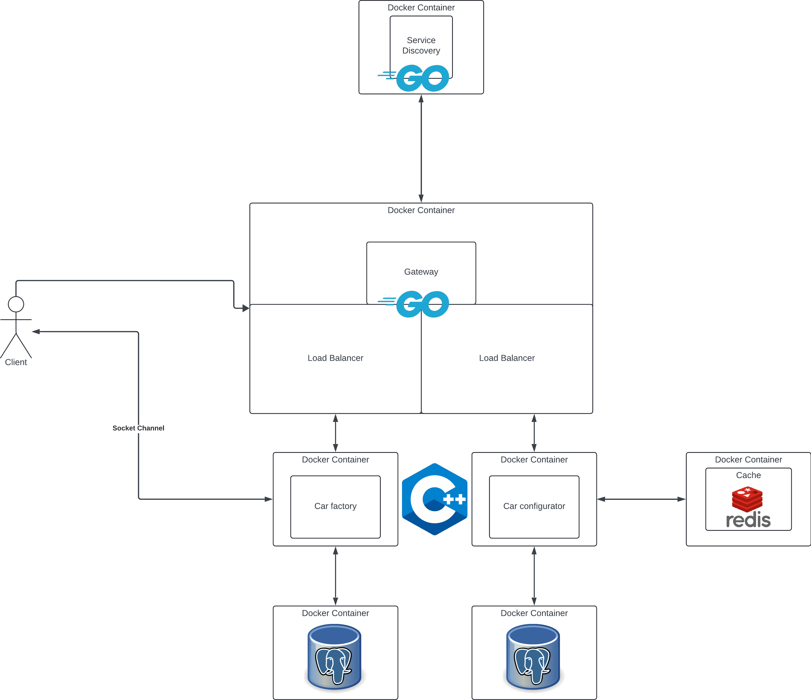

# CarPal: A Car Configuration and Purchase Platform

**Vision:** To create a robust platform where users can configure and purchase cars, offering real-time customization, efficient scalability, and seamless user experience.

## Microservices Architecture Suitability

The car configuration and buying platform is an ideal fit for microservice architecture due to:

### Extensibility

- The platform involves multiple specialized services, such as car configuration, factory management, and purchase processing.
- Microservices architecture ensures that each service can be developed, deployed, and maintained independently, making it easier to scale and manage complexity.

### Speed and Flexibility

- Microservices allow independent development and deployment for different services like configuration or order processing, enabling faster delivery of new features and updates without affecting the entire system.

### Scalability

- Different services have varying scaling needs; for example, the car configuration service might need to handle more requests during peak times than the car purchase service.
- Microservices architecture enables independent scaling based on service-specific demand.

---

## Examples of Microservices in Action

**1. Tesla:** Uses a similar architecture where each component of the user journey—from car customization to order processing—is handled by different services.

**2. BMW:** Their online car configurator and order management system is built on microservices, allowing them to scale and add new features dynamically.

**3. Toyota:** Utilizes microservices to manage a variety of functionalities, such as pricing, inventory checks, and financing options, each of which can be scaled separately.

---

## Platform Architecture Overview



The architecture comprises several Docker containers running distinct microservices, as visualized in the diagram, each representing a core platform component.

### Service Components

- **API Gateway:** Acts as the entry point for user requests.
- **Load Balancer:** Distributes requests across service replicas to ensure no single service gets overloaded.
- **Service Discovery:** Dynamically registers and locates services, simplifying the communication process.
- **Cache (Redis):** Improves performance by storing frequently accessed data like car configurations.
- **Car Factory Service:** Manages orders and production schedules for configured cars.
- **Car Configurator Service:** Allows users to build and customize their vehicles.

### Data Flow

- Users interact with the **Car Configurator** through a socket channel, allowing real-time customization.
- The configurations are cached using Redis, while final selections are stored in the PostgreSQL database.
- Upon placing an order, the **Car Factory Service** processes the order and communicates with the backend to ensure seamless production.

---

## Technology Stack and Communication Patterns

### Asynchronous Communication

- **WebSockets** enable real-time updates during car configuration, allowing instant feedback on options like colors, trims, and accessories.

### Synchronous Communication

- **gRPC** for service-to-service communication between the backend services, providing low-latency, high-performance interactions.
- **HTTP/REST** for client-facing APIs, such as submitting orders and user account management.

### Core Technologies

- **C++:** For implementing core services like the Car Factory and Configurator.
- **GoLang:** For managing the API Gateway and Service Discovery.
- **Docker:** All services are containerized for better deployment and scalability.
- **PostgreSQL:** For persistent storage of user accounts, orders, and car configurations.
- **Redis:** For caching frequently accessed data like popular car configurations.

---

## Service Breakdown

1. **Car Configurator Service:**
    - Enables users to customize their car’s features, such as engine type, exterior color, interior design, and add-ons.
    - Frequently accessed configurations (popular models or colors) are cached in Redis for quicker load times.

2. **Car Factory Service:**
    - Handles the order once a user finalizes their car configuration.
    - Communicates with inventory management to ensure the availability of parts and processes production scheduling.

3. **User Login and Authentication:**
    - Manages user registration, login, and secure sessions using JWT tokens.
    - Authenticated users can save their car configurations and track orders.

### Communication

- **WebSockets** are used in the Car Configurator Service to instantly reflect user changes in real time, offering dynamic and interactive feedback.
- **gRPC** allows fast and lightweight communication between backend services, such as when the Car Factory Service checks inventory levels before proceeding with an order.

---

## Example Endpoints

### Car Configurator Service

### Request:

```http
POST /api/configure
{
  "engine": "V6",
  "color": "Red",
  "interior": "Leather",
  "features": ["Sunroof", "GPS"]
}
```

### Response:

```json
{
  "configId": "abc123",
  "message": "Configuration saved successfully."
}
```

---

### Request:

```http
GET /api/configure/{configId}
```

### Response:

```json
{
  "engine": "V6",
  "color": "Red",
  "interior": "Leather",
  "features": ["Sunroof", "GPS"],
  "price": "45000"
}
```

---

### Request:

```http
POST /api/factory/order
Header: { "jwt": "1234" }
{
  "configId": "abc123",
  "userId": "u789"
}
```

### Response:

```json
{
  "orderId": "o567",
  "message": "Order placed successfully."
}
```

---

### Request:

```http
GET /api/factory/order/{orderId}
```

### Response:

```json
{
  "status": "In Production",
  "estimatedDelivery": "2024-12-15"
}
```

---

## Deployment and Scaling

- **Docker Containers:** All services are containerized, enabling independent scaling of high-demand services like the Car Configurator.
- **Horizontal Scaling:** Services like Car Configurator and Car Factory can be scaled independently to handle peak demand without affecting other parts of the system.
- **Docker Compose:** Used for orchestrating multi-container deployment, simplifying the process of scaling, networking, and managing services.

---

This architecture enables a dynamic, scalable, and responsive platform for car configuration and purchasing, providing real-time customization options, efficient order processing, and the ability to handle increasing traffic with ease.
